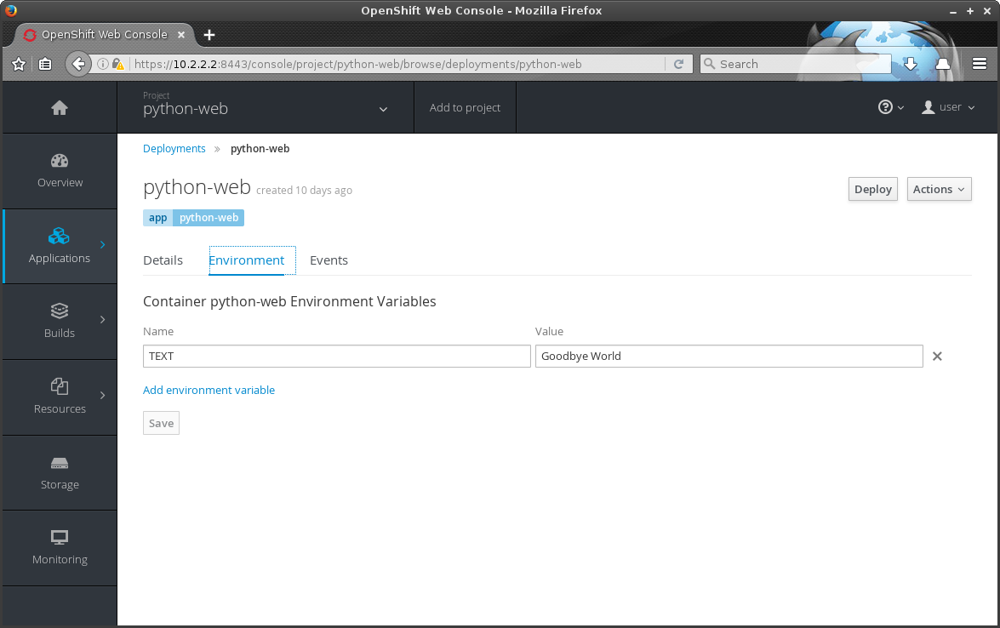

Integrating with OpenShift
==========================

While it is simple to :doc:`deploy an image on OpenShift <deployment>`,
there are certain guidelines and integration techniques that should be
adhered to.

Creating Images
---------------

The OpenShift documentation contains a section on
`image creation guidelines <https://docs.openshift.com/container-platform/3.3/creating_images/guidelines.html>`_,
so rather than repeat that information here, it's recommended to be familiar
with the practices in that document. Points of particular interest will be
included in the rest of this guide.

Environment Variables
---------------------

It is impractical to rebuild an image for each possible configuration,
especially if the image is owned by someone else. The recommended mechanism
for configuring a service running in a container is through environment
variables.

Environment variables are set in the deployment configuration. They can be
set when the configuration is first created or can be added/modified/removed
after an application has been deployed. It is important to realize that
changes to the environment variables constitute a deployment configuration
change. The existing pods are not modified; rather, new pods are deployed with
the changed configuration and will automatically replace the existing ones
(this is easily seen on the UI overview page with the graphical depictions of
scaling up and down).

This paradigm is used both for images created for deployment as well as those
intended to be used as builder images with :ref:`build_s2i`. For example,
the Python builder image will, by default, attempt to run a file named
``app.py``. If an application cannot be modified to use this naming scheme,
the environment variable ``APP_FILE`` can be specified to indicate a new
script to run when the container is launched.

Example
~~~~~~~

Below is the output for the deployment configuration of a simple web
application. The application is written such that it will output "Hello
World" when it is not overridden with environment variables.

As a reminder, the list of a particular resource can be viewed using the
``get`` command, followed by the resource type in question (``dc`` is an
abbreviaton for deployment configuration):

.. code-block:: none

   $ oc get dc
   NAME         REVISION   DESIRED   CURRENT   TRIGGERED BY
   python-web   3          1         1         config,image(python-web:latest)

The details of the configuration can be displayed with the ``describe``
command (some of the irrelevant information has been removed for brevity):

.. code-block:: none
   :emphasize-lines: 22

   $ oc describe dc python-web
   Name:        python-web
   Namespace:   python-web
   Created:     10 days ago
   Labels:      app=python-web
   Annotations: openshift.io/generated-by=OpenShiftNewApp
   Latest Version:   3
   Selector:    app=python-web,deploymentconfig=python-web
   Replicas:    1
   Triggers:    Config, Image(python-web@latest, auto=true)
   Strategy:    Rolling
   Template:
     Labels:    app=python-web
       deploymentconfig=python-web
     Annotations:   openshift.io/container.python-web.image.entrypoint=["/bin/sh","-c","cd /src/www; /bin/bash -c 'python3 -u /src/web.py'"]
       openshift.io/generated-by=OpenShiftNewApp
     Containers:
       python-web:
         Image:                 jdob/python-web@sha256:3f87be1825405ee8c7da23d7a6916090ecbb2d6e7b04fcd0fd1dc194173d2bc0
         Port:                  8080/TCP
         Volume Mounts:         <none>
         Environment Variables: <none>
     No volumes.

Note that there are no environment variables set for the application. Viewing
the application (through its route), displays the default "Hello World" text:

.. code-block:: none

   $ oc get route
   NAME         HOST/PORT                                    PATH      SERVICES     PORT       TERMINATION
   python-web   python-web-python-web.apps.10.2.2.2.xip.io             python-web   8080-tcp

   $ curl http://python-web-python-web.apps.10.2.2.2.xip.io
   Hello World

There are a few options for editing environment variables. The UI can be
used to navigate to the deployment configuration. The "Environment" tab
can be used to view and modify environment variables for the configuration.
When changes are saved by pressing the "Save" button, a new deployment
is triggered using the new configuration values.

Alternatively, the CLI's ``edit`` command can be used to interactively edit
the YAML representation of many resources. This command, called by specifying
a resource type and name, opens a text editor in which changes can be made.
When the file is saved and the editor is closed, the changes are sent to
the server and the appropriate action is taken. In this case, the change in
configuration will cause a redeployment.

Below is a snippet of the deployment configuration while being edited
(removed sections are replaced with ``[snip]`` for readability). The
changes made are highlighted:

.. code-block:: none
   :emphasize-lines: 17-19

   $ oc edit dc python-web
   # Please edit the object below. Lines beginning with a '#' will be ignored,
   # and an empty file will abort the edit. If an error occurs while saving this file will be
   # reopened with the relevant failures.
   #
   apiVersion: v1
   kind: DeploymentConfig
   metadata:
     [snip]
   spec:
     [snip]
     template:
       metadata:
         [snip]
       spec:
         containers:
         - env:
           - name: TEXT
             value: Goodbye World
           image: jdob/python-web@sha256:3f87be1825405ee8c7da23d7a6916090ecbb2d6e7b04fcd0fd1dc194173d2bc0
           imagePullPolicy: Always
           name: python-web

The changes above introduce a new environment variable named ``TEXT`` which,
if present, is output by the web server when it is accessed. For reference,
the relevant Python line in the application is::

    m = os.environ.get('TEXT', None) or 'Hello World'

At this point, there are a few ways to monitor the changes being made. The
UI presents a graphical view of the existing pods scaling down while new ones
are created with the new configuration. The CLI's ``status`` command can be
used to show that a new deployment was made:

.. code-block:: none

   $ oc status                                                                                                                                                                        1 ↵
   In project python-web on server https://localhost:8443

   http://python-web-python-web.apps.10.2.2.2.xip.io to pod port 8080-tcp (svc/python-web)
     dc/python-web deploys istag/python-web:latest
       deployment #2 deployed 9 minutes ago - 1 pod
       deployment #1 deployed 48 minutes ago

Notice that a new deployment was made, corresponding to the updated deployment
configuration that was submitted. As proof of the environment variable's
presence in the container, the previous ``curl`` command can be run again:

.. code-block:: none

   $ curl http://python-web-python-web.apps.10.2.2.2.xip.io
   Goodbye World

Users
-----

One of the more common obstacles encountered with creating new images
revolves around the user running the container process. By default, Docker
containers are run as root. This can become a
`security issue <http://blog.dscpl.com.au/2015/12/don-run-as-root-inside-of-docker.html>`_
as any process that breaks out of the container will retain the same privileges on the host
machine; root in a container would have access to root on the host.

By default, OpenShift will issue a warning when loading an image defined to
run as root and, in many cases, the deployment will fail with some form of
permission error. These failures are due to the fact that OpenShift creates a
random, non-privileged user (with no corresponding UID on the host machine)
and runs the container with that user. This is an added security benefit
provided by OpenShift and, while not difficult, must be acknowledged when
creating images.

Since OpenShift is generating a random UID, the solution isn't as simple as
`creating and using a user <http://blog.dscpl.com.au/2015/12/overriding-user-docker-containers-run-as.html>`_
(by its name) within the container. There are potential security issues
where a created user can still give itself root privileges. The use of a
random ID, specified by OpenShift, also supports added security for
multi-tenancy by forcing persistent storage volume UIDs to be unique for each
project.

In short, since OpenShift runs containers as a randomized, non-privileged user,
the image must be constructed with those limitations in mind.

The common solution is to make the necessary files and directories
`writable by the root group <http://blog.dscpl.com.au/2015/12/random-user-ids-when-running-docker.html>`_.

Example
~~~~~~~

Below is a snippet from a Dockerfile used to run httpd as a non-privileged
container. This setup will host pages from the ``/opt/app-root`` directory.
For brevity, the Dockerfile ``EXPOSE`` and corresponding
httpd configuration changes to serve on a non-privileged port are not
included in the snippet.

.. code-block:: none
   :emphasize-lines: 11, 18, 23

   # Create a non root account called 'default' to be the owner of all the
   # files which the Apache httpd server will be hosting. This account
   # needs to be in group 'root' (gid=0) as that is the group that the
   # Apache httpd server would use if the container is later run with a
   # unique user ID not present in the host account database, using the
   # command 'docker run -u'.

   ENV HOME=/opt/app-root

   RUN mkdir -p ${HOME} && \
       useradd -u 1001 -r -g 0 -d ${HOME} -s /sbin/nologin \
               -c "Default Application User" default

   # Fixup all the directories under the account so they are group writable
   # to the 'root' group (gid=0) so they can be updated if necessary, such
   # as would occur if using 'oc rsync' to copy files into a container.

   RUN chown -R 1001:0 /opt/app-root && \
       find ${HOME} -type d -exec chmod g+ws {} \;

   # Ensure container runs as non root account from its home directory.
   WORKDIR ${HOME}
   USER 1001

Note the usage of a numeric UID instead of the named user. This is done for
portability across hosting providers and will pass checks to ensure that,
at very least, the container is not being run as root (this check is
impossible using named users).

Labels
------

In this context, labels refer to the Docker concept of labels: metadata
on an image. These are specified in the Dockerfile and are included in the
built image.

Partner container certification requires that images include the following
labels:

 * Name
 * Vendor
 * Version
 * Release

The container partner team provides a sample Dockerfile that can be used
as a template for images suitable for certification. It can be found
on `GitHub <https://github.com/RHsyseng/container-rhel-examples/blob/master/starter/Dockerfile>`_.

Example
~~~~~~~

The following snippet uses the Dockerfile ``LABEL`` directive to define
the minimum required labels::

  LABEL Name="jdob/python-web" \
        Vendor="Red Hat" \
        Version="1.0" \
        Release="1"

The labels can be viewed using the ``docker inspect`` command (the output
below is truncated::

  $ docker inspect --format {{.ContainerConfig.Labels}} jdob/python-web                                                                                                              1 ↵
    map[Name:jdob/python-web Release:1 Vendor:Red Hat Version:1.0]

Authenticating to the OpenShift APIs
------------------------------------

Service accounts may be used to authenticate against the OpenShift API without
the need to use a regular user's credentials. This can be used for
integrations that require extra information about the running system in which
they are deployed, such as for discovery or monitoring purposes. Service
accounts are identified by a username and its roles can be manipulated
in the same way.

In order to properly configure permissions for a service account, some
understanding of the security role system is required.

Security Context Constraints
~~~~~~~~~~~~~~~~~~~~~~~~~~~~

.. warning::
  Operations on secutiry context constraints can only be performed
  by an admin user, including listing or describing existing SCCs.

Security Context Constraints (SCC for short) define a set of access
permissions. Users and service accounts are added to SCCs to permit them
the privileges defined by the SCC.

A list of all defined SCCs can be retrieved using the ``get`` command and
the ``scc`` resource type:

.. code-block:: none

   NAME               PRIV      CAPS      SELINUX     RUNASUSER          FSGROUP     SUPGROUP    PRIORITY   READONLYROOTFS   VOLUMES
   anyuid             false     []        MustRunAs   RunAsAny           RunAsAny    RunAsAny    10         false            [configMap downwardAPI emptyDir persistentVolumeClaim secret]
   hostaccess         false     []        MustRunAs   MustRunAsRange     MustRunAs   RunAsAny    <none>     false            [configMap downwardAPI emptyDir hostPath persistentVolumeClaim secret]
   hostmount-anyuid   false     []        MustRunAs   RunAsAny           RunAsAny    RunAsAny    <none>     false            [configMap downwardAPI emptyDir hostPath nfs persistentVolumeClaim secret]
   hostnetwork        false     []        MustRunAs   MustRunAsRange     MustRunAs   MustRunAs   <none>     false            [configMap downwardAPI emptyDir persistentVolumeClaim secret]
   nonroot            false     []        MustRunAs   MustRunAsNonRoot   RunAsAny    RunAsAny    <none>     false            [configMap downwardAPI emptyDir persistentVolumeClaim secret]
   privileged         true      []        RunAsAny    RunAsAny           RunAsAny    RunAsAny    <none>     false            [*]
   restricted         false     []        MustRunAs   MustRunAsRange     MustRunAs   RunAsAny    <none>     false            [configMap downwardAPI emptyDir persistentVolumeClaim secret]

Specific details are displayed using the ``describe`` command. Below is the
output for the default ``restricted`` SCC:

.. code-block:: none
   :emphasize-lines: 4

   Name:                        restricted
   Priority:                    <none>
   Access:
     Users:                     <none>
     Groups:                    system:authenticated
   Settings:
     Allow Privileged:              false
     Default Add Capabilities:      <none>
     Required Drop Capabilities:    KILL,MKNOD,SYS_CHROOT,SETUID,SETGID
     Allowed Capabilities:          <none>
     Allowed Volume Types:          configMap,downwardAPI,emptyDir,persistentVolumeClaim,secret
     Allow Host Network:            false
     Allow Host Ports:              false
     Allow Host PID:                false
     Allow Host IPC:                false
     Read Only Root Filesystem:     false
     Run As User Strategy: MustRunAsRange
       UID:                     <none>
       UID Range Min:           <none>
       UID Range Max:           <none>
     SELinux Context Strategy: MustRunAs
       User:                    <none>
       Role:                    <none>
       Type:                    <none>
       Level:                   <none>
     FSGroup Strategy: MustRunAs
       Ranges:                  <none>
     Supplemental Groups Strategy: RunAsAny
       Ranges:                  <none>

The SCC description includes information on what is permitted to users in the
SCC. The ``Access`` section indicates which users are granted access to the
SCC. Note that service accounts are treated as users in this context and
will appear in this list as well.

Users are granted access to an SCC through the admin policy (``adm policy``)
command:

.. code-block:: none

   $ oc adm policy add-scc-to-user restricted onboard

   $ oc describe scc restricted
   Name:                    restricted
   Priority:                <none>
   Access:
     Users:                 onboard
     Groups:                system:authenticated
   [output truncated]

Service Accounts
~~~~~~~~~~~~~~~~

Service accounts exist within the scope of a particular project. Given that,
cluster admin privileges are not required. Like other API objects, they are
created and deleted through the ``create`` command:

.. code-block:: none

   $ oc create serviceaccount onboard-sa
     serviceaccount "onboard-sa" created

   $ oc get sa
     NAME         SECRETS   AGE
     builder      2         <invalid>
     default      2         <invalid>
     deployer     2         <invalid>
     onboard-sa   2         <invalid>

In the example above, the service account will be created in the currently
active project. A different project may be specified using the ``-n`` flag.

All projects are configured with three default service accounts:

 * builder - Build pods use this SCC to push images into the internal
   Docker registry and manipulate image streams.
 * deployer - Used to view and edit replication controllers.
 * default - Used to run all non-builder pods unless explicitly overridden.

Service accounts can be added to SCCs in the same way as users with one
notable exception. The username for the service account must be fully qualified
as a service account and identifying the project in which it exists. The
template for the user name is::

  system:serviceaccount:<project>:<sa-name>

For example, to add the previously created service account (assuming it was
under the project name ``demo``):

.. code-block:: none

   $ oc adm policy add-scc-to-user restricted system:serviceaccount:demo:onboard-sa

   $ oc describe scc restricted
   Name:                    restricted
   Priority:                <none>
   Access:
     Users:                 system:serviceaccount:demo:onboard-sa
     Groups:                system:authenticated

Authenticating as a Service Account
~~~~~~~~~~~~~~~~~~~~~~~~~~~~~~~~~~~

There are two ways to retrieve an API token for the service account.

Externally Retrieving a Token
.............................

The ``describe`` command can be used to show the tokens that were created
for a service account:

.. code-block:: none

   $ oc describe sa onboard-sa                                                                                                                                                        1 ↵
   Name:		onboard-sa
   Namespace:	guestbook
   Labels:		<none>

   Image pull secrets:	onboard-sa-dockercfg-myuk7

   Mountable secrets: 	onboard-sa-token-tuwfj
                        onboard-sa-dockercfg-myuk7

   Tokens:            	onboard-sa-token-n79y5
                        onboard-sa-token-tuwfj

In this case, the list ``Tokens`` is of interest. The token itself can be
retrieved through the ``describe`` command for the secret (the actual
token value is truncated for brevity):

.. code-block:: none

   $ oc describe secret onboard-sa-token-n79y5                                                                                                                                        1 ↵
   Name:		onboard-sa-token-n79y5
   Namespace:	guestbook
   Labels:		<none>
   Annotations:	kubernetes.io/service-account.name=onboard-sa
           kubernetes.io/service-account.uid=efe81599-bd6f-11e6-b14e-5254009f9a8b

   Type:	kubernetes.io/service-account-token

   Data
   ====
   ca.crt:		1066 bytes
   namespace:	9 bytes
   token:		eyJhbGciOi...

Assuming the token value is saved to an environment variable named TOKEN,
the list of users can be retrieved with the following ``curl`` command:

.. code-block:: none
   :emphasize-lines: 7, 8

   $ TOKEN="$(cat /var/run/secrets/kubernetes.io/serviceaccount/token)"
   $ curl -k "https://10.1.2.2:8443/oapi/v1/users/~" -H "Authorization: Bearer $TOKEN"                                                                                                 1 ↵
     {
      "kind": "User",
      "apiVersion": "v1",
      "metadata": {
        "name": "system:serviceaccount:demo:onboard-sa",
        "selfLink": "/oapi/v1/users/system:serviceaccount:demo:onboard-sa",
        "creationTimestamp": null
      },
      "identities": null,
      "groups": [
        "system:serviceaccounts",
        "system:serviceaccounts:demo"
      ]
    }

From Within a Container
.......................

The API token for the service account associated with a deployment
configuration is automatically injected into each container when it is
created. The service account for a container can be changed from the default
to an account with the proper permissions based on the need. The token
is stored inside the container at::

  /var/run/secrets/kubernetes.io/serviceaccount/token

Using the same curl command as above:

.. code-block:: none
   :emphasize-lines: 7, 8

   $ TOKEN="$(cat /var/run/secrets/kubernetes.io/serviceaccount/token)"
   $ curl -k "https://10.1.2.2:8443/oapi/v1/users/~" -H "Authorization: Bearer $TOKEN"                                                                                                 1 ↵
     {
      "kind": "User",
      "apiVersion": "v1",
      "metadata": {
        "name": "system:serviceaccount:demo:default",
        "selfLink": "/oapi/v1/users/system:serviceaccount:demo:default",
        "creationTimestamp": null
      },
      "identities": null,
      "groups": [
        "system:serviceaccounts",
        "system:serviceaccounts:demo"
      ]
    }

This output was taken from a container with no additional configuration,
so the self reference refers to the project's ``default`` service account.

..
   Writing Deployment Templates
   ----------------------------

   Example
   ~~~~~~~

   .. _create_builder_image:

   Creating a Builder Image
   ------------------------

   Example
   ~~~~~~~

   Liveness and Readiness
   ----------------------

   Example
   ~~~~~~~
