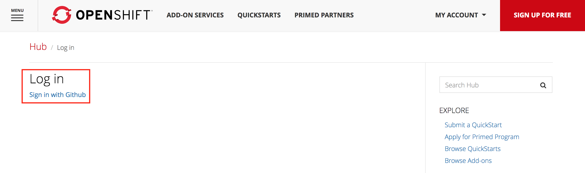

[[involved]]
== Getting Involved
include::includes/header.adoc[]

There are a number of ways to engage with the OpenShift teams and begin
to promote new integrations and ideas.

[[commons]]
=== Commons

https://commons.openshift.org/[OpenShift Commons] provides a community for partners, users, customers, and contributors to build connections
and share best practices, facilitating collaboration and awareness of project involvement with OpenShift.
Additionally, regular https://commons.openshift.org/briefings.html[briefings] are hosted and allow for deeper dives
into various topics.

[[primed]]
=== Primed

Red Hat OpenShift Primed is a technical readiness designation that acknowledges
the first steps of an ISV's technology working with OpenShift by providing the ISV a
designated logo and awareness through OpenShift online properties such as
https://hub.openshift.com/[Hub] and https://commons.openshift.org/[OpenShift Commons].
To earn this designation, ISVs must demonstrate an initial commitment to OpenShift.

To sign up for the program, visit https://www.openshift.com/primed.

. Click on Apply Now.
. Sign in with GitHub to get access to the Primed application.
+

. The Primed application:
+
[horizontal]
*_Name_*:: Name of the company or organization
*_Summary_*:: Information about OpenShift integration
*_More Information URL_*:: Link to organization web page
*_Evidence of integration_*:: Demonstration of the integration -
blog entries, how-to guides, source code, or videos will satisfy the
requirement.
*_Primed For_*:: OpenShift offering
*_Version Number_*:: OpenShift version number the integration was tested
against

[[openshift-blog]]
=== OpenShift Blog

The https://blog.openshift.com/[OpenShift Blog] hosts posts on a
variety of topics. In particular, the
https://blog.openshift.com/category/openshift-ecosystem/[ecosystem] tag
highlights posts written by ISV teams to showcase their integrations.
Partners in the Primed program have the opportunity to submit entries to be
hosted on this blog to showcase their integrations.

[[red-hat-connect]]
=== Red Hat Connect

A natural progression from the Primed program is https://connect.redhat.com/[Red Hat Connect for Technical Partners].

The program is designed to assist companies who are actively seeking to develop, test, certify and support their products and solutions with the Red Hat portfolio.
Participants in the program will gain access to a strong ecosystem of companies that are building software, hardware and cloud-based solutions for enterprise customers across the world.

Partners developing solutions for OpenShift should apply for access to the https://connect.redhat.com/zones/containers[containers zone]. All members of the program are required certify their images
to gain access to the ecosystem.

[[certification]]
=== Certification

Red Hat Container Certification is available for software vendors that offer commercial
applications packaged and distributed as containers. The certification process is intended to help ensure that applications are
built and packaged according to Red Hat's enterprise standards.

In addition to the practices outlined under <<integration#recommended-practices, recommended practices>>, software vendors should ensure that their containers meet the following requirements.

* Images should contain a directory named `/licenses` that holds all relevant licensing information.
** End users should be aware of the terms and conditions applicable to the image.
* Image dockerfiles should contain the following labels:
** name
** vendor
** version
** release
* Images should contain a help file as outlined http://docs.projectatomic.io/container-best-practices/#_creating_a_help_file[here].
* Images should have a tag other than latest so that they can be uniquely identified.

The policy describing these standards can be found https://connect.redhat.com/zones/containers/container-certification-policy-guide#good_layer_count[here] (Red Hat Connect login required).

Red Hat Partner Engineering mantains an example Dockerfile https://github.com/RHsyseng/container-rhel-examples/blob/master/starter/Dockerfile[here] which hits all the basic requirements for certification.
